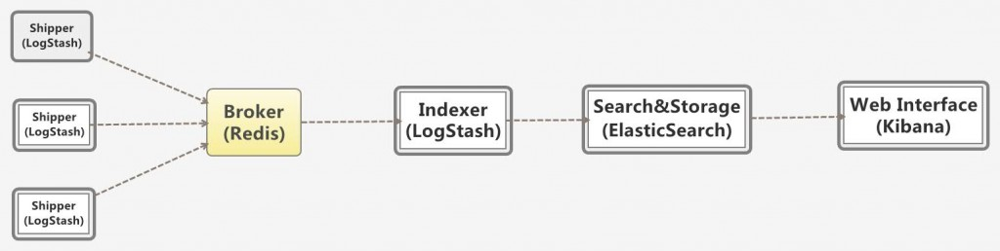
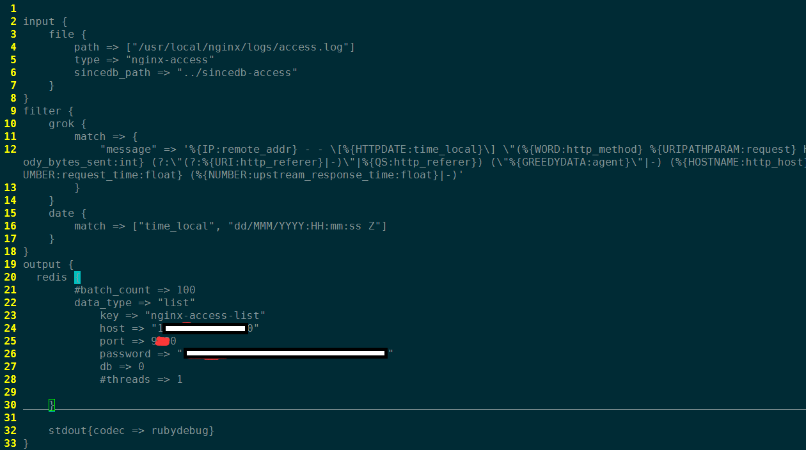
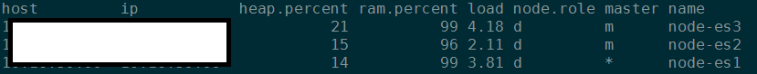
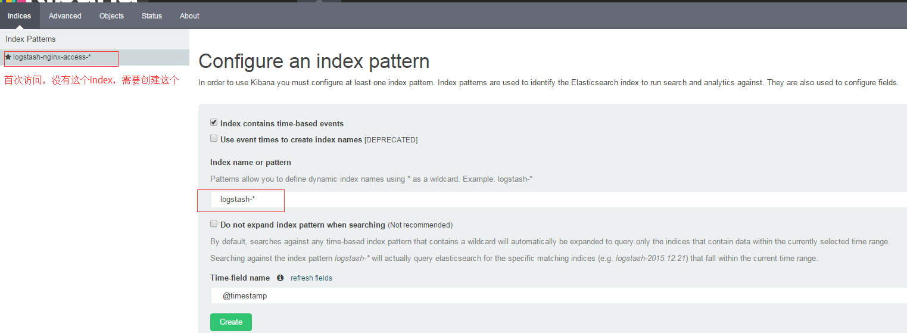
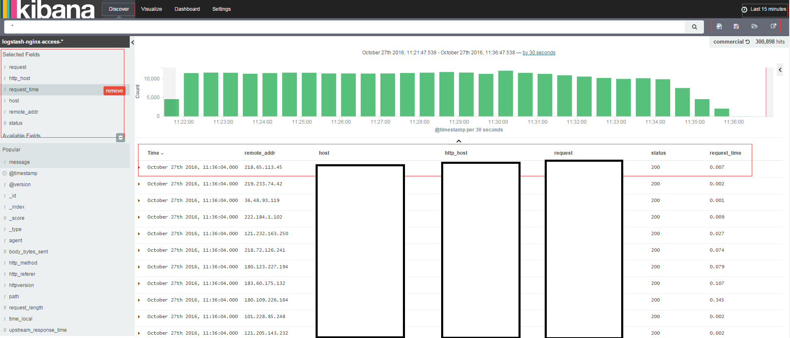
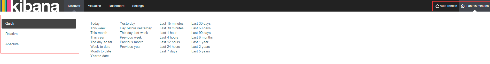
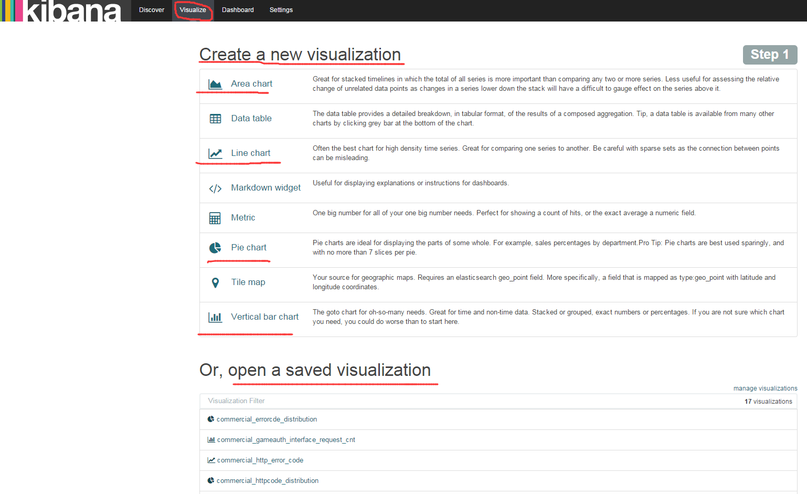
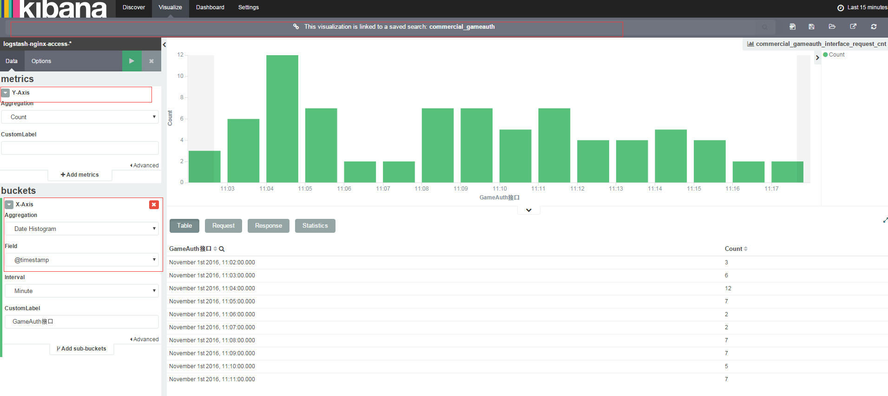

## 1. ELK概述
操作系统，应用服务和各类业务等，都在不停地产生各样的日志，Elastic Stack 在最近几年迅速崛起，成为数据分析，或者说实时日志处理领域的首要选择。

特点：

- 检索性能高效。
- 集群线性扩展。
- 处理方式灵活。
- 配置简易上手。

ELK，也就是Elasticsearch、Logstash、Kibana三者的结合，是一套开源的分布式日志管理方案.

Elasticsearch：负责日志存储、检索和分析

LogStash：负责日志的收集、处理

Kibana：负责日志的可视化

**方案：**


--------------------------------------


## 2. 环境搭建

为整体环境创建一个合适的目录，```mkdir $project_path/ELK```, project_path 根据情况而定，例如"/usr/local"。 

### 2.1 安装依赖
logstash和elasticsearch均依赖java，所以安装这两个之前，我们应该先安装好java，版本 > java7. java的安装这里不做赘述。

----------------------------------

### 2.2 logstash

#### 2.2.1 基础安装配置
首先，去[Elastic官网](https://www.elastic.co/products)下载对应平台安装文件，可下载的文件类型有zip、rpm、deb、tgz等，个人建议直接下载zip包，解压即用，方便。


> wget https://download.elastic.co/logstash/logstash/logstash-all-plugins-2.4.0.zip
> 
> unzip logstash-all-plugins-2.4.0.zip


解压之后，进入logstash目录，创建"conf"目录，编写配置文件。下面以收集分析nginx access 日志为例。


```

input {
    file {
        path => ["/usr/local/nginx/logs/access.log"]
    }   
}
filter {
    grok {
        patterns_dir => "../patterns"
            match => {
                "message" => "%{NGINXACCESS}"
            }   
    }   
    date {
        match => ["time_local", "dd/MMM/YYYY:HH:mm:ss Z"] 
    }   
}
output {
    elasticsearch {
        hosts => ["10.16.59.99:9200"]
            index => "logstash-nginx-%{+YYYY.MM.dd}"
            workers => 1
            flush_size => 1
            idle_flush_time => 1
            template_overwrite => true
    }   
    stdout{codec => rubydebug}
}

```

配置文件分为三个部分：input，filter，output。三部分文件写，也可写一块

- input
    定义输入，file为输入的文件，可以有多个。出file外，还有stdin、TCP、syslog、collectd等。

- filter
    过滤配置，可以将日志整理成自己想要的格式。logstash有丰富的过滤插件，date处理、grop正则捕获、GeoIP、JSON编码、key-value切分等等。
    grok是logstash最重要的插件，在grok中定义好正在表达式，可以在其他地方引用它。语法这里不过多介绍，需要可以自己从网上学习。
    
    这里我们要抓取Nginx日志，需要根据Nginx的日志格式写一个过滤的正则表达式，将其保存在".logstash/patterns/nginx"文件中，内容如下：

    
    ```
    
    NGINXACCESS %{IP:remote_addr} - - \[%{HTTPDATE:time_local}\] \"%{WORD:http_method} %{URIPATHPARAM:request} HTTP/%{NUMBER:httpversion}\" %{NUMBER:status:int} %{NUMBER:body_bytes_sent:int} (?:\"(?:%{URI:http_referer}|-)\"|%{QS:http_referer}) \"%{GREEDYDATA:agent}\" %{HOSTNAME:http_host} %{NUMBER:request_length:int} %{NUMBER:request_time:float} %{NUMBER:upstream_response_time:float}
    ```

-------------------------------------------
**注意:** 此处的正则表达式要和nginx的日志格式相对应，否则会匹配失败，无法将nginx日志离散取值。

nginx 日志格式例子：

```
log_format  combinedio  '$remote_addr - $remote_user [$time_local] '
                        '"$request" $status $body_bytes_sent '
                        '"$http_referer" "$http_user_agent" $http_host $request_length $request_time $upstream_response_time';
```
----------------------------------------

- output    
    logstash的输出也有多种，标准输出，输出到elasticsearch，redis等等， 可以同时指定多个输出，stdout方便调试，查看实时的日志。
    输出到es说明：hosts 为es的ip和端口；index为索引名称，按日期分方便管理；

    运行logstsh：```./bin/logstash -f conf/logstash-nginx.conf```
    选项"-f"是logstahsh的配置文件，如果有多个配置文件，也可以是一个目录。
    %{NUMBER:status:int} 将status字段设为整型，
    %{NUMBER:request_time:float} 将Request_time设为float类型，[**重要**]，方便kibana计算可视化

------------------------------------------------

####logstash 2.2.2 分角色部署

将logstash按功能分成三个角色：shipper、broker和indexer。每个角色使用不同的logstash配置。

- shipper角色（日志收集）

input部分配置要收集的日志文件或原始日志来源
filter部分可以用grok过滤日志
output部分将格式化的日志输出到broker角色中（此处以redis为例，作为缓冲消息队列）




- broker角色（消息队列）

需要为此角色启动一个redis服务，可以去[redis官网](http://redis.io/download)进行下载，然后编译安装，这里不再做详细介绍。
启动服务时，先修改或新建一个redis配置文件（如，redis.conf）, 安全起见，配置下端口和密码，其他的可使用默认配置。

>  ./redis-server /path/to/redis.conf

- indexer角色
功能：从redis中取出日志，然后存储到elasticsearch集群中。


**提示：为提高数据的写入效率，可以根据机器硬件因素适当提高threads和works的数量，也可以多设置几个indexer角色，同时运行。**

### 2.3 elasticsearch部署   

####2.3.1 下载

首先下载es文件，和logstash类似，这里直接下载zip文件    

```
wget https://download.elastic.co/elasticsearch/release/org/elasticsearch/distribution/zip/elasticsearch/2.4.1/elasticsearch-2.4.1.zip

unzip elasticsearch-2.4.1.zip
``` 

####2.3.2 配置es

主要是配置elasticsearch.yml文件，主要有network，node，path，memory等几个方面，单机模式下主要配置network，其他采用默认即可。

```

\# ---------------------------------- Network -----------------------------------

\# Set the bind address to a specific IP (IPv4 or IPv6):

 network.host: 10.16.59.99

\# Set a custom port for HTTP:

  http.port: 9200


```


####2.3.3 运行elasticsearch

> 
> ./bin/./bin/elasticsearch
> 

####2.3.4 elasticsearch 集群部署

在日志量比较大时候，单机模式满足我们的需求，这时候可以选择将elasticsearch集群化部署。
通过配置elasticsearch.yml文件，配置各个节点。es2.4的版本是可以自动发现节点的，可以将节点的ip（多个或其中一个）放在discovery.zen.ping.unicast.hosts中即可。 下面是一个节点配置的例子：

```
\# ======================== Elasticsearch Configuration =========================

\# Use a descriptive name for your cluster:

 cluster.name: es_log_monitor

\# ------------------------------------ Node ------------------------------------

\# Use a descriptive name for the node:

 node.name: node-es1

 bootstrap.memory_lock: true

 network.host: 10.16.59.99    
 http.port: 9200    

 discovery.zen.ping.unicast.hosts: ["10.16.59.112"]

 #node.master: true    
 #node.data: false
```

-------------------------------------------------

"node.master"和"node.data"可以选择性配置

- master为true，data为false：节点不存储数据，作为协调者
- master为false，data为true：节点作为数据存储节点，不会被选为master节点
- master为false，data为false：均衡负载
- 默认都为true

使用以下命令查看节点的状态：

> curl 10.16.59.99:9200/_cat/nodes?v




####2.3.5 使用head插件管理和查看集群状态

安装head插件，进入elasticsearch目录下，运行如下命令:

> ./bin/plugin install mobz/elasticsearch-head

安装之后可以便可通过流量器进行访问了，注意是否需要设置防火墙，也可以配置nginx 反向代理通过80端口访问。


--------------------------------------------------

### 2.4 kibana部署

####2.4.1 下载解压kibana文件

> 
> wget https://download.elastic.co/kibana/kibana/kibana-4.6.1-linux-x86_64.tar.gz
> 
> tar -zxvf kibana-4.6.1-linux-x86_64.tar.gz -C ./

####2.4.2 配置kibana.yml文件
打开kibana.yml文件，主要修改以下三个点(找到对应的地方修改)：

```
 server.port: 5601          #kibana 服务端口
 server.host: "127.0.0.1"   #服务绑定的地址
 elasticsearch.url: "http://10.16.59.99:9200"   #es服务地址
```

####2.4.3 运行kibana

> 
> ./bin/kibana
> 

运行以后可通过浏览器用地址加端口打开kibana的可视化页面。（网络开放情况下）

####2.4.4 为kibana服务配置反向代理（非必须）

有些情况下，很多服务器只开发80,443等少量常用端口，这时候如果还想通过80端口访问，需要配置反向代理，这里以nginx为例。    
在nginx的配置目录中(include)，添加"kibana_proxy.conf"文件，内容如下：

```    
server {
    listen           80; 
    server_name   kibana.xxx.xxx.cn;


    location / {
        proxy_set_header Host   $http_host; 
        proxy_pass       http://127.0.0.1:5601$request_uri;
        allow all;
    }
}

```

将此文件包含到nginx.conf中

```
http {
    include       mime.types;
    default_type  application/octet-stream;

    ... ...
    ... ...
        
    include include/*.conf;
}

 ```
 如果已包含include目录，则直接重新加载nginx

 > 
 > $nginx_path/sbin/nginx -s reload
 >

--------------------------------------------------------------------------------
 
##3. kibana使用简单说明

###3.1 设置index

首次访问kibana的时候，会被要求定义一个index pattern用来匹配一个或者多个索引名。之后还可以从顶部导航栏中的“settings”添加更多的index pattern。通过浏览器访问kibana界面，初次使用跳转到如下界面：

 

我们可以指定一个或者匹配多个elasticsearch所以的index pattern。通配符"*"匹配索引名中0到多个字符。选择一个包含时间戳的索引字段可以用来做基于时间处理。新索引中带有时间戳，定期生成，再选择"Use event times to create index names"选项，然后选择"Index pattern interval"可以提高搜索性能。

###3.2 Discover查询数据

进入kibana的Discover，在这里可以提交搜索请求，过滤搜索结果，返回检索数据。Discover属于交互式查询数据，我们可以看到匹配搜索请求的文档总数，获取字段值得统计情况。



- 时间过滤器

在界面的右上角有个时间过滤器的设置，默认值为最近15分钟，它将搜索结果限定在特定的时间范围内。打开时间过滤器，有三种方式可供选择，一是快速选择一个时间段（今天，这周，最近15分钟，最近半小时，最近1小时等等）； 二是相对时间选择，可以选择自多长时间到现在；三是绝对时间选择，自主选择时间段的数据。



- 搜索数据

支持的语法：Lucene 查询语法和基于JSON的query DSL。主要操作步骤点：

a) 简单文本搜索，直接输入文本字符串。    
b) 搜索特定字段值，在值前面加上字段的值。例如，“status:200”将会显示所有status字段为200的内容。    
c) 搜索一个值的范围，使用范围查询语法, [Start_value TO End_value], 例如要查找4xx的状态码，可以输入"status:[400 TO 499]".    
d) 更复杂的搜索，可以使用and，or和not。    

- 新建查询、保存查询、加载已保存的查询

###3.3 可视化功能

Visualize标签用来设计可视化，可以保存可视化的结果拱以后使用，加载合并到仪表盘里。界面如下图所示。



可视化功能基于以下几种数据源类型：


* 新的交互式查询
* 已保存的查询
* 已保存的可视化

可视化操作编辑器。

可视化编辑器用来配置编辑可视化视图，如下图所示：




- 工具栏

工具栏有交互式搜索框，可保存加载可视化，刷新可视化数据。

- 聚合构建器（Aggregation Builder）

左侧有metric和bucket聚合。bucket效果类似于sql group by语句。想进一步了解聚合，可以阅读[elasticsearch aggregation reference](https://www.elastic.co/guide/en/elasticsearch/reference/current/search-aggregations.html).

在柱状图或折线图中，metrics做Y轴，buckets做X轴，饼图里metrics做分片大小，buckets做分片数量。

###3.4 仪表盘

Kibana中dashboard能够自由排列已保存的可视化，还可以保存、重载和分享当前的仪表盘。仪表盘主要操作有以下几方面：

1. 工具栏上

	- 创建一个新的仪表盘    
	首次进入dashboard，Kibana显示一个空白仪表盘，可以通过添加可视化视图构建仪表盘。
	- 添加可视化到仪表盘
	点击右侧的“+”号按钮，从Visualize容器中选择合适的可视化放入仪表盘中，可以通过拖拽调整视图的位置和大小。
	- 保存和加载仪表盘

2. 容器

可进行的操作有移动容器、改变容器大小、删除容器、查看容器详细信息。

还可以修改可视化，即对可视化视图进行编辑。


 -------------------------------------------------------------------------------
 
##4. 参考资料

 [1]. https://www.elastic.co    
 [2]. 《ELK stack权威指南》    
 [3]. https://discuss.elastic.co/t/nginx-log-filter-problem/46744    
 [4]. http://grokdebug.herokuapp.com/     
 [5]. https://chenjiehua.me/linux/elk-log-system-setup.html    
