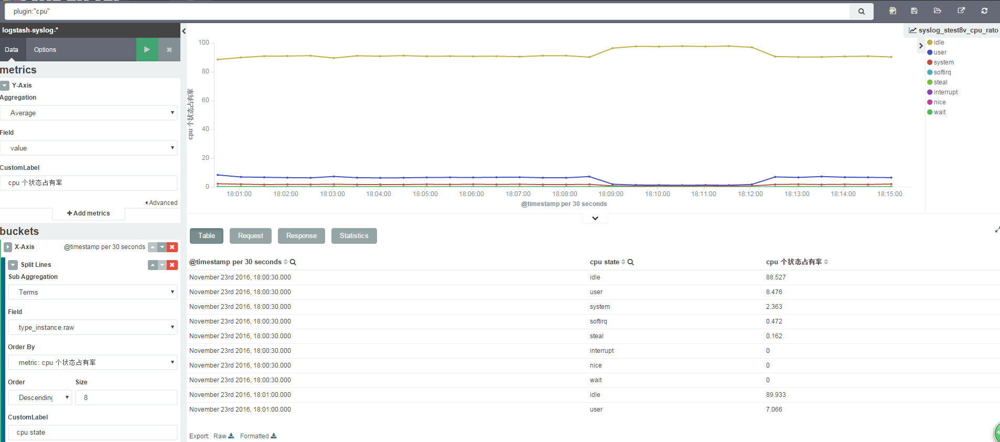
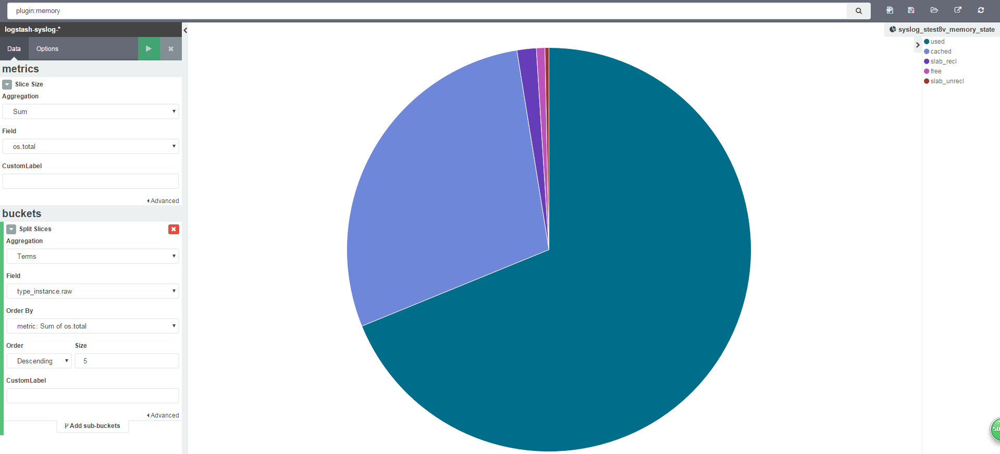
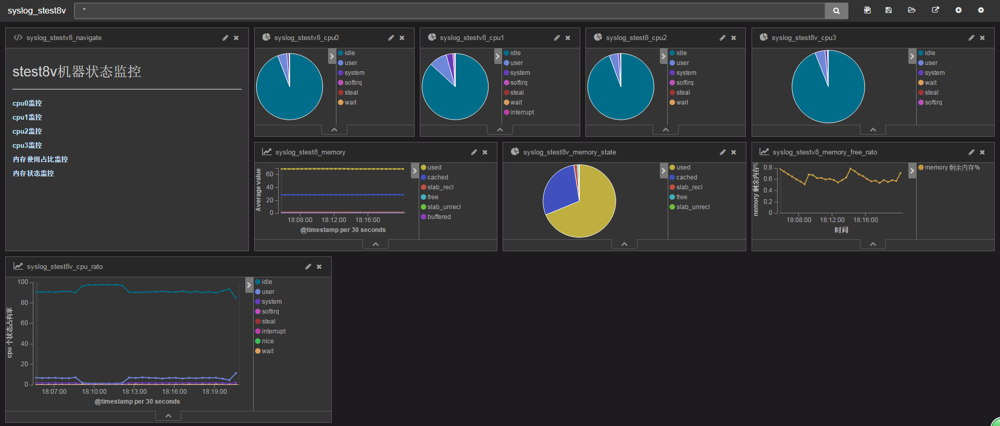

## 需求描述

使用collectd收集系统cpu,memory状态信息，通过ELK stack做存储和可视化的展示。
系统：centos6

--------------------------------------

## collectd安装和配置

collectd安装可以通过yum的方式安装，也可以通过源码编译的方式进行安装，你可以根据需要进行选择。

### 通过源码编译安装

1. 下载collectd

首先在[collectd官网](https://collectd.org/download.shtml)选择合适的稳定版本.这里以collectd5.6为例。

```wget https://storage.googleapis.com/collectd-tarballs/collectd-5.6.1.tar.bz2```

2. 编译collectd

```
tar xf /collectd-5.6.1.tar.bz2 
cd collectd-5.6.1 
./configure  --prefix=/usr/local/collectd
make all install
```

"--prefix"指定软件的安装目录，如果不指定的话使用默认配置，安照系统安装软件的方式安装，配置、库、可执行程序相对比较分散；

3. 配置collectd

进入collectd的安装程序目录（/usr/local/collectd）, 将原来etc下的collectd.conf备份一下, 重新编辑一下collectd.conf的内容如下：

```    
\# For each instance where collectd is running, we define     
\# hostname proper to that instance. When metrics from    
\# multiple instances are aggregated, hostname will tell     
\# us were they came from.    
Hostname "test.syslog"     
 
\# Fully qualified domain name, false for our little lab    
FQDNLookup false    
 
\# Plugins we are going to use with their configurations,    
\# if needed     
LoadPlugin cpu        
<Plugin cpu\>        
        ReportByState = true        
        ReportByCpu = true        
        ValuesPercentage = true        
</Plugin\>        
        
LoadPlugin interface         
<Plugin interface\>        
        Interface "eth0"        
        IgnoreSelected false        
</Plugin\>        
         
LoadPlugin network        
<Plugin network\>        
        Server "192.168.1.102" "24866" # 服务的ip为本机ip， 端口自定义一个没有被占用的端口        
</Plugin\>        
         
LoadPlugin memory        
<Plugin memory\>        
        ValuesAbsolute false        
        ValuesPercentage true        
</Plugin\>        
        
         
LoadPlugin syslog        
<Plugin syslog\>        
        LogLevel info        
</Plugin\>    
 
LoadPlugin swap
 
<Include "./etc/collectd.conf.d"\>  # 如果还用其他的配置可用此种方式将其引用进来，没有的话则不用配置此项    
        Filter ".conf"    
</Include\>    
```

检查配置是否正确：

```./sbin/collectd -t ./etc/collectd.conf```

4. 启动运行collectd

以后台进程的形式启动

> nohup ./sbin/collectd -C etc/collectd.conf &

### yum 方式安装

首先可以用```yum list | grep collectd```查看是否含有collectd的安装包，如果有的话，可通过如下命令安装。

> sudo yum install collectd

配置collectd.conf, 文件的目录一般在"/etc/collectd.conf"，配置方式如上。

检查配置是否正确， ```/usr/sbin/collectd -t /etc/collectd.conf```


启动程序, centos7以下，可以用```service collectd start```, centos7用命令```systemctl start collectd.service```


## logstash 配置

配置logstash的shipper角色，抓取collectd收集的系统日志，并发送到redis消息队列（broker角色）   
 
 
`input {    
  udp {    
    port => 24866         # 25826 matches port specified in collectd.conf    
    buffer_size => 1452   # 1452 is the default buffer size for Collectd    
    codec => collectd { } # specific Collectd codec to invoke    
    type => collectd     
  }        
}    
    
output {       
  redis {     
        batch => true    
        batch_events => 100    
        data_type => "list"    
            key => "syslog-list"    
            host => "192.168.1.100"    
            port => 9988    
            password => "pass pass"    
            db => 0    
            #threads => 1    
    }      
    stdout{codec => rubydebug}    
}`

redis的ip，密码和相应的端口号填实际环境中的对应的值。

logstash的index角色要做响应的更改，在原来内容的基础上，添加syslog的部分，具体内容如下：

```
input {    
    redis {    
        batch_count => 1000 #EVAL命令返回的事件数目    
        data_type => "list" #logstash redis插件工作方式    
            key => "nginx-access-list" #监听的键值    
            threads => 20    
            host => "192.168.1.100" #redis地址    
            port => 9988 #redis端口号    
            password => "pass pass" #如果有安全认证，此项为密码    
            db => 0 #redis数据库的编号    
    
        type => "nginx_access"    
    }        
    
    redis {    
        batch_count => 1000 #EVAL命令返回的事件数目    
        data_type => "list" #logstash redis插件工作方式    
            key => "syslog-list" #监听的键值    
            threads => 2    
            host => "192.168.1.100" #redis地址    
            port => 9988 #redis端口号    
            password => "pass pass" #如果有安全认证，此项为密码    
            db => 0 #redis数据库的编号    

        type => "collectd"     
    }    
}    
filter {    
   
}    
output {    
    if [type] == "nginx_access" {    
        elasticsearch {    
            hosts => ["192.168.1.102:9200"]    
                index => "logstash-nginx-access-%{+YYYY.MM.dd}"    
                workers => 20    
                flush_size => 1   
                idle_flush_time => 1   
                template_overwrite => true    
        }    
    } else if [type] == "collectd" {    
        elasticsearch {   
            hosts => ["192.168.1.102:9200"]    
                index => "logstash-syslog-%{+YYYY.MM.dd}"    
                workers => 2    
                flush_size => 1    
                idle_flush_time => 1    
                template_overwrite => true    
        }        
    }    
    stdout{codec => rubydebug}    
}    
```

--------------------------------------

## kibana操作

首先，在setting页面创建"logstash-syslog-*"的索引，刷新feild的值，然后就可以去Discover或者Visualize页面做查询和可视化操作了。

1. cpu整体状态监控示例

在Visualize页面，新建line图查询，查询内容'plugin:"cpu"'.

- Y轴选average, Feild为value.

- X-Axis选为Date Histogram

- 添加split lines， Sub aggregation选为terms，feild为type_instance.raw

效果图如下：



2. 内存状态监控示例

在Visualize页面，新建pipe chart图，查询内容'plugin:"memory"'.

- Metrics选sum，feild为value

- Buckets选terms，feild为type_instance.raw

效果图如下：



3. 其他

整体效果图如下：



更多展示参考地址:

http://kibana.monitor.cn/app/kibana#/dashboard/syslog_stest8v


-----------------------------
**注意**：需要配置host    
      192.168.1.102 kibana.monitor.cn    

----------------------------
